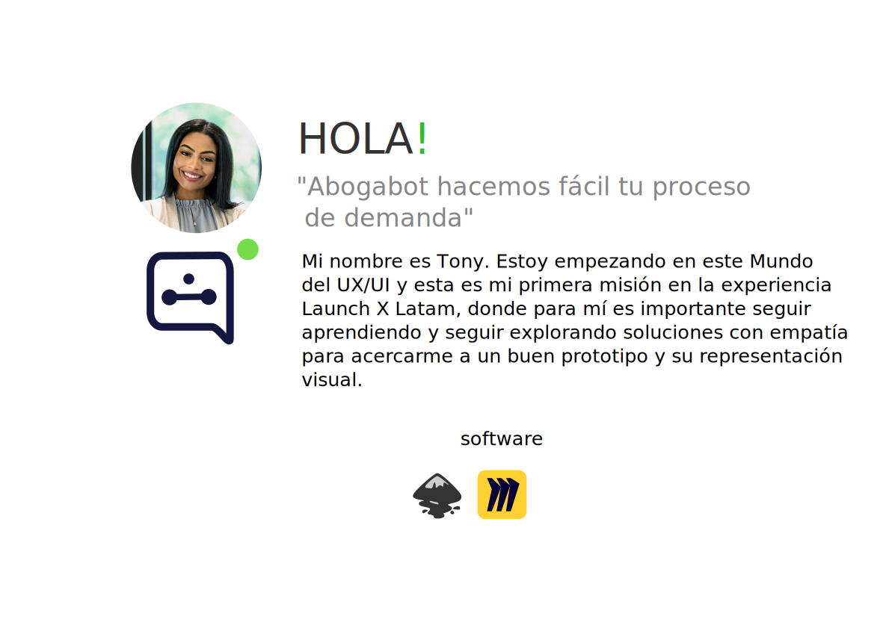
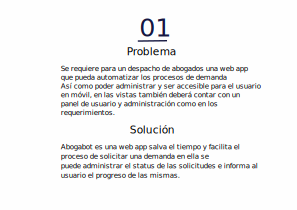
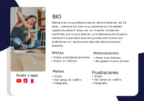
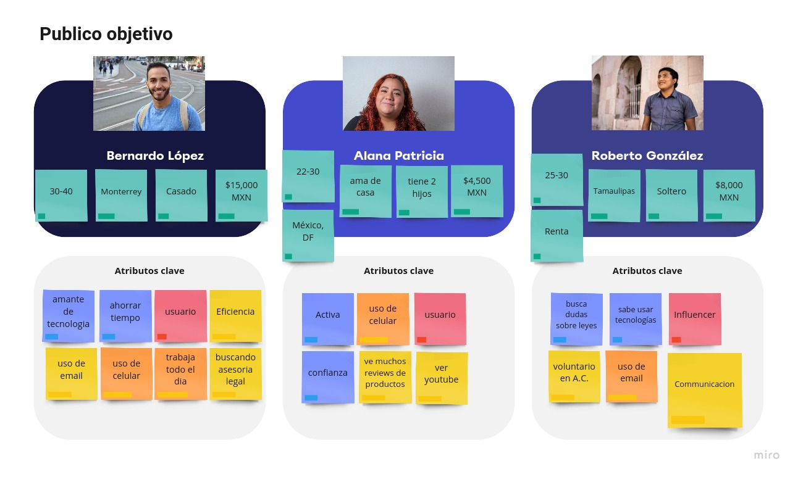
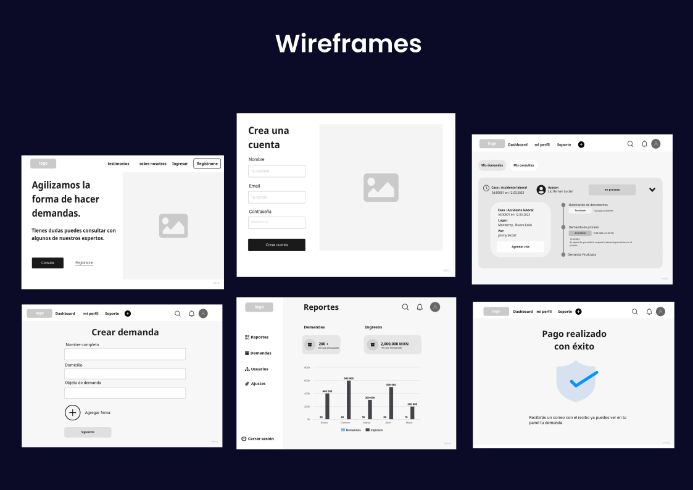
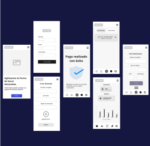
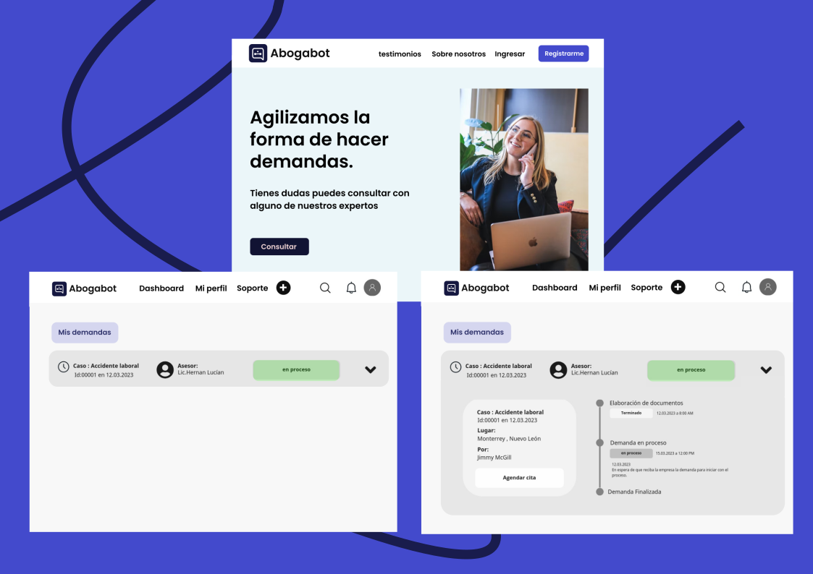

<h2 style="text-align: center;">Introduccion practica de UX / UI</h2>

Explorer tony 🚀

## Caso de estudio : Abogabot

## Miro : aqui todos los frames
[Miro enlace](https://miro.com/app/board/uXjVPRKK4Pg=/)

