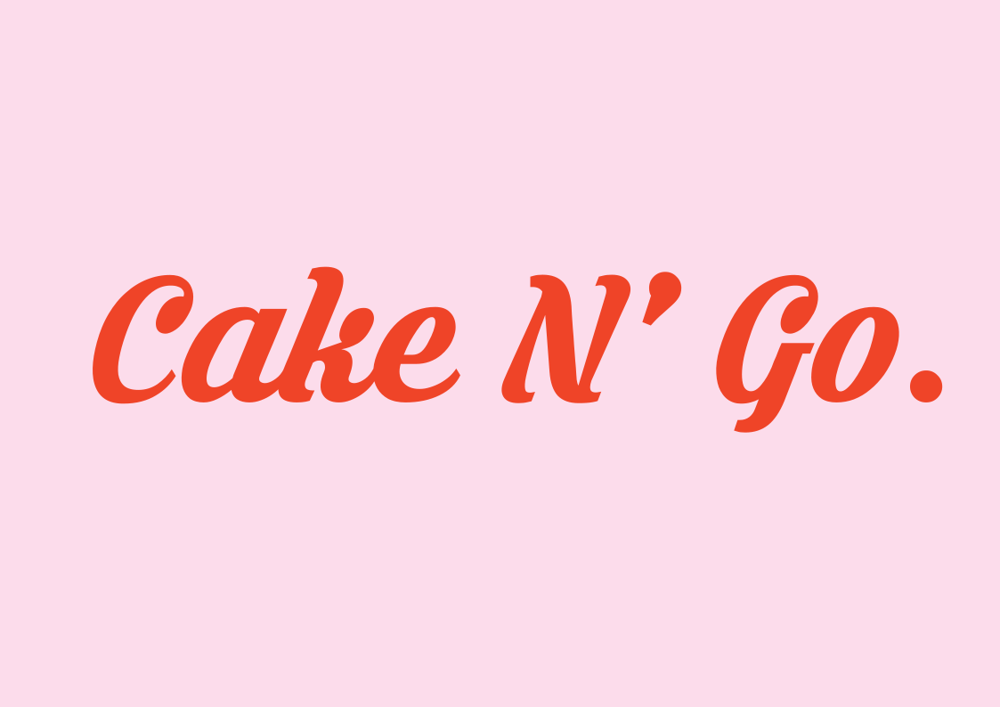
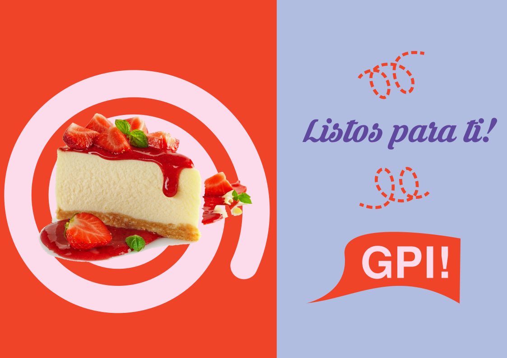
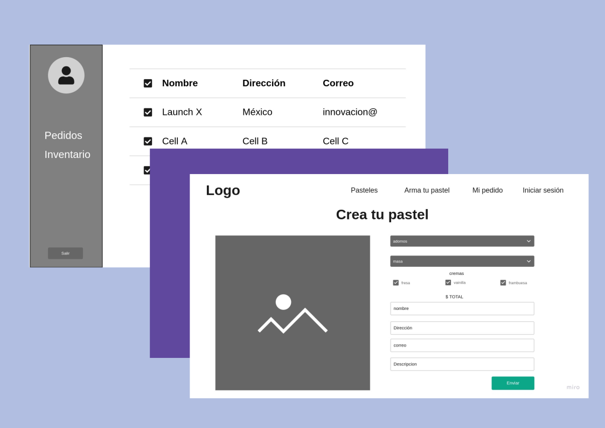

<h2 style="text-align: center;">Práctica HTML</h2>

### 👨‍💻 Listados de marcos de trabajo

* HTML
* CSS
* sass
* JavaScript
* nomeclatura BEM

## Caso de estudio : Pasteleria Cake N Go

## Wireframes

### 🗎 descargar de proyecto y colabora

* para descargar `git clone` y ejecuta en tu navegador preferido.

# Gracias por ver!:sparkles:
- [@T0ny-dev](https://github.com/T0ny-dev)

