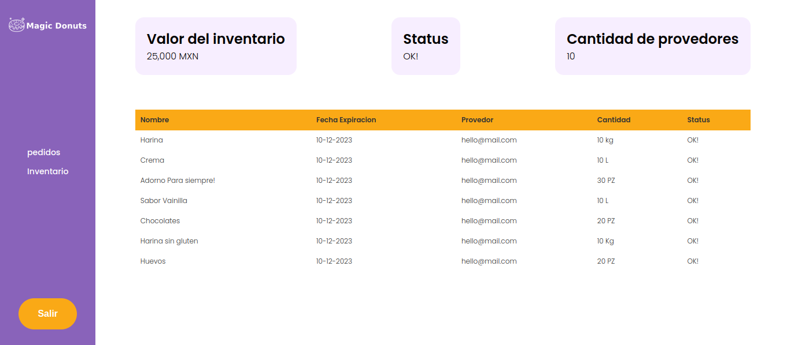
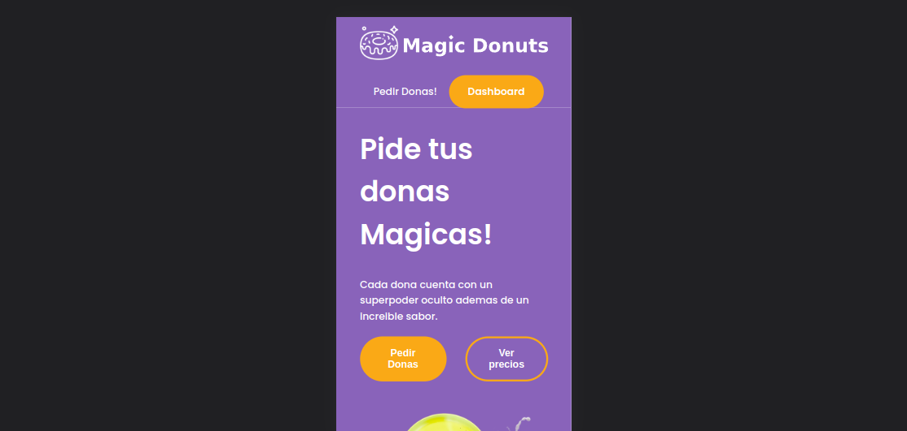
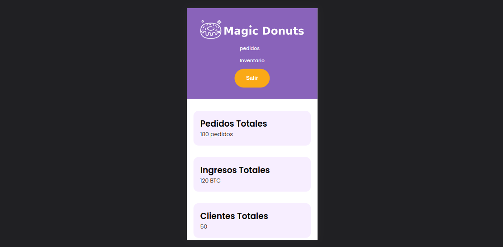

# 02-HTML 

  <h1>🍩 Web en HTML de Repostería</h1>
  <strong>Documentación del proyecto y marcos de trabajo que se utilizan</strong> 
  <strong>Launch X Latam Microsoft/Innovación Virtual Bootcamp</strong>

 

## Web estatica

Es un portal que debe contar con funcionabilidades:

* Web estática
* Mostrar precios, Adornos disponibles, productos, datos de horarios, lugar y formulario de pedidos
* Dashboard interno de Pedidos e Inventario
 

### 🏗 Equipo: 

- [@T0ny-dev](https://github.com/T0ny-dev)

### 👨‍💻 Listados de marcos de trabajo

* HTML
* CSS
* SASS
* Metodología BEM CSS
* Vite

### 💻 Listados comandos 

* `npm install `  iniciara las dependencias de vite
* `npm run dev `  iniciara el servidor para vista previa en localhost:5173

### 💻 Deploy
- [netlify](https://02-html-launch-x-latam.netlify.app/)

### 🗎 Capturas del proyecto

