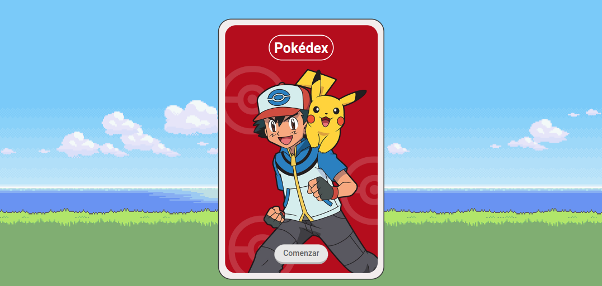
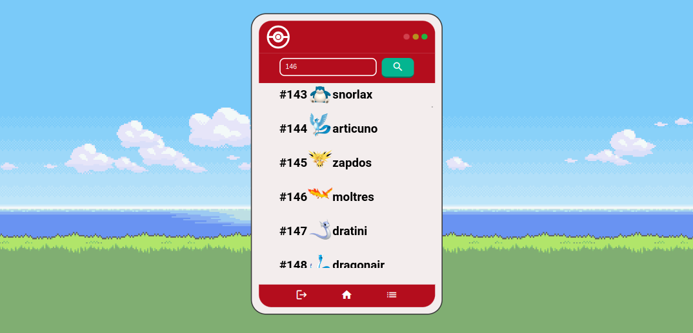
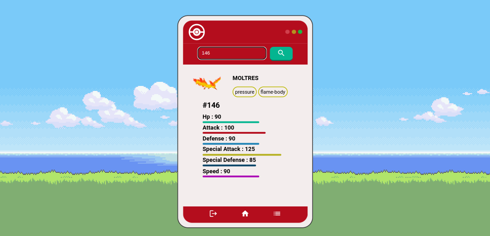
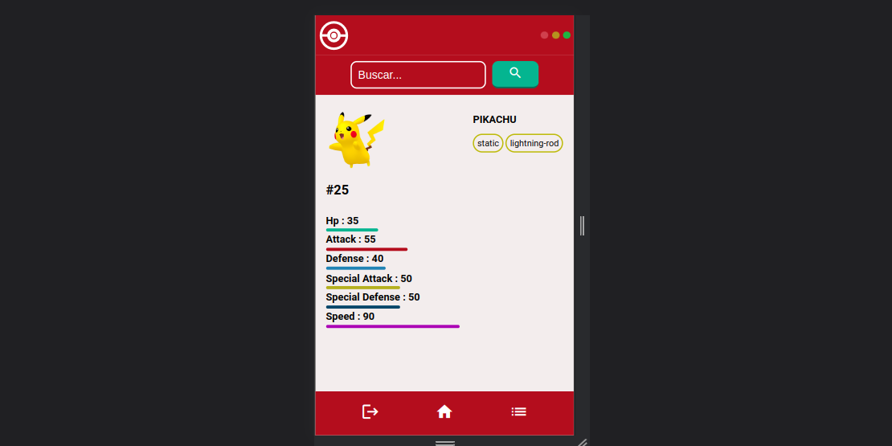
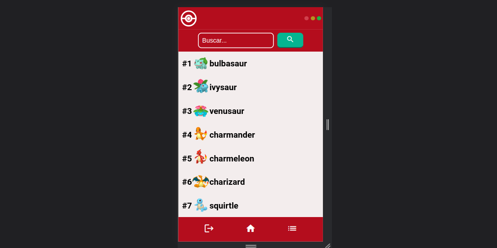

# 04-JS

  <h1>Pokédex 👾</h1>
  <strong>Documentación del proyecto y marcos de trabajo que se utilizan</strong> 
  <strong>Launch X Latam Microsoft / Innovación Virtual Bootcamp</strong>

 

## Desafio de JS

El proyecto  debe contar con funcionabilidades:

* Lista de pokemons
* Diseño de pokedex
* Utilizar poke-API
* Mostrar nombre, atributos y clases
 

### 🏗 Equipo: 

- [@T0ny-dev](https://github.com/T0ny-dev)

### 👨‍💻 Listados de marcos de trabajo

* HTML
* CSS
* SASS
* Metodología BEM CSS
* Vite
* JavaScript
* Libreria Axios

### 💻 Listados comandos 

* `npm install `  instalara las dependencias de vite
* `npm run dev `  iniciara el servidor para vista previa en localhost:5173

### 💻 Deploy

- [netlify](https://04-js-launch-x-latam.netlify.app/)

### 🗎 Capturas del proyecto

