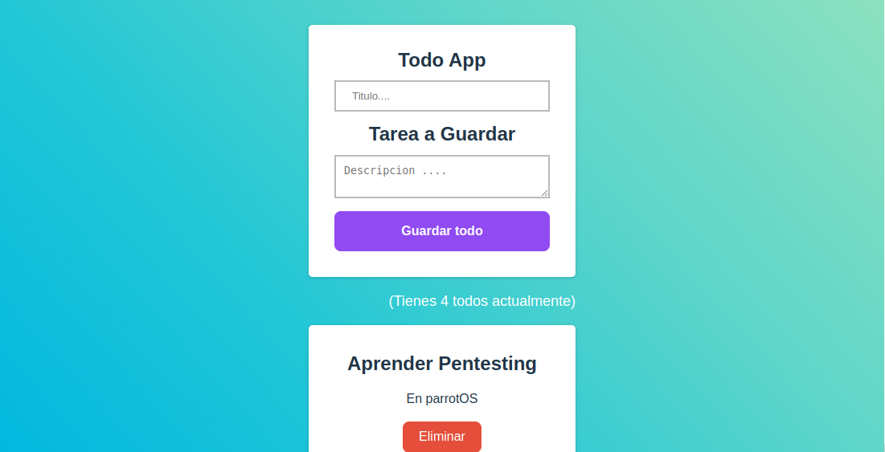

# 05-Todos

  <h1>Todos 🍏</h1>
  <strong>Documentación del proyecto y marcos de trabajo que se utilizan</strong> 
  <strong>Launch X Latam Microsoft / Innovación Virtual Bootcamp</strong>

 

## Desafio de JS

El proyecto  debe contar con funcionabilidades:

* Crear Todo
* Eliminar todo
* Cantidad de Todos

 

### 🏗 Equipo: 

- [@T0ny-dev](https://github.com/T0ny-dev)

### 👨‍💻 Listados de marcos de trabajo

* HTML
* CSS
* Vite
* JavaScript
* React

### 💻 Listados comandos 

* `npm install `  instalara las dependencias de vite
* `npm run dev `  iniciara el servidor para vista previa en localhost:5173

### 💻 Deploy

- [netlify](https://05-todos-lauch-x-latam.netlify.app/)

### 🗎 Capturas del proyecto

