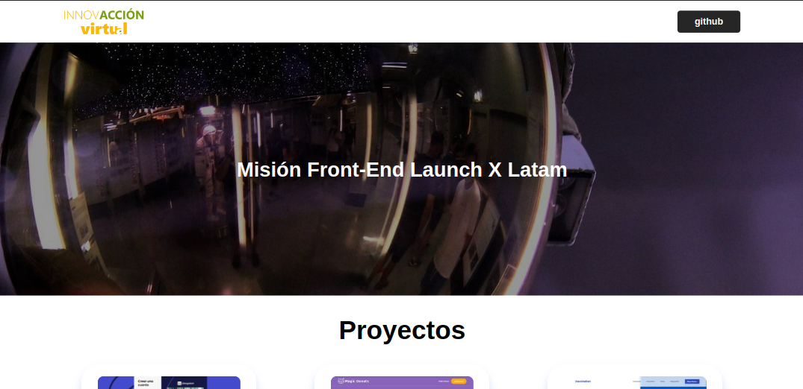
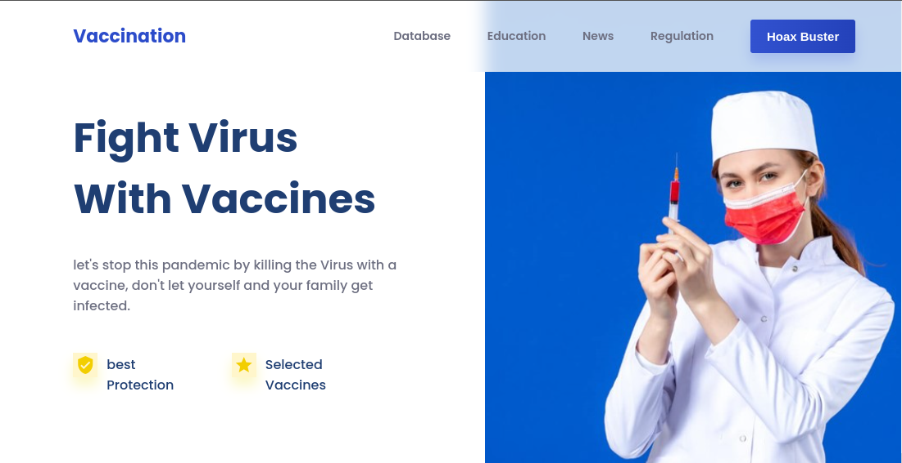

# Repositorio de Prácticas

  <h1>Misión Frontend</h1>
  <strong>Documentación del proyecto y marcos de trabajo que se utilizan</strong> 
  <strong>Launch X Latam Microsoft / Innovación Virtual Bootcamp</strong>

 

## Repo de entregas

Es una recopilación de prácticas de la experiencia Launch X Latam:

* Crear un index.html general de navegación 
* Hacer el despliegue de todos los proyectos 
 

### 🏗 Equipo: 

- [@T0ny-dev](https://github.com/T0ny-dev)

### 👨‍💻 Listados de marcos de trabajo

* HTML
* CSS
* SASS
* Metodología BEM CSS
* Vite
* JavaScript
* Libreria Axios

### 💻 Listados comandos 

* `git clone `    Clonara el repositorio
* `npm install `  instalará las dependencias de vite
* `npm run dev `  iniciara el servidor para vista previa en localhost:5173

### 💻 Deploy GitHub Pages
- [GitHub Pages](https://t0ny-dev.github.io/MisionFrontEnd-Launch-X-Latam/)

- [Portafolio-Personal](https://t0ny-dev.netlify.app/)

### 🗎 Capturas del proyecto

### 01-INTRO Caso Abogabot 

[Ver repo](https://github.com/T0ny-dev/MisionFrontEnd-Launch-X-Latam/tree/main/01-INTRO)

### 02-HTML Web de Formulario de pedidos y Dashboard 

[Ver repositorio](https://github.com/T0ny-dev/MisionFrontEnd-Launch-X-Latam/tree/main/02-HTML)

[Ver proyecto](https://02-html-launch-x-latam.netlify.app/)

### 03-CSS Desafio de CSS

[Ver repositorio](https://github.com/T0ny-dev/MisionFrontEnd-Launch-X-Latam/tree/main/03-CSS)

[Ver proyecto](https://03-css-launch-x-latam.netlify.app/)

### 04-JS Pokédex PokéAPI

[Ver repositorio](https://github.com/T0ny-dev/MisionFrontEnd-Launch-X-Latam/tree/main/04-JS)

[Ver proyecto](https://04-js-launch-x-latam.netlify.app/)

### 05-Todos 

[Ver repositorio](https://github.com/T0ny-dev/MisionFrontEnd-Launch-X-Latam/tree/main/05-todos)

